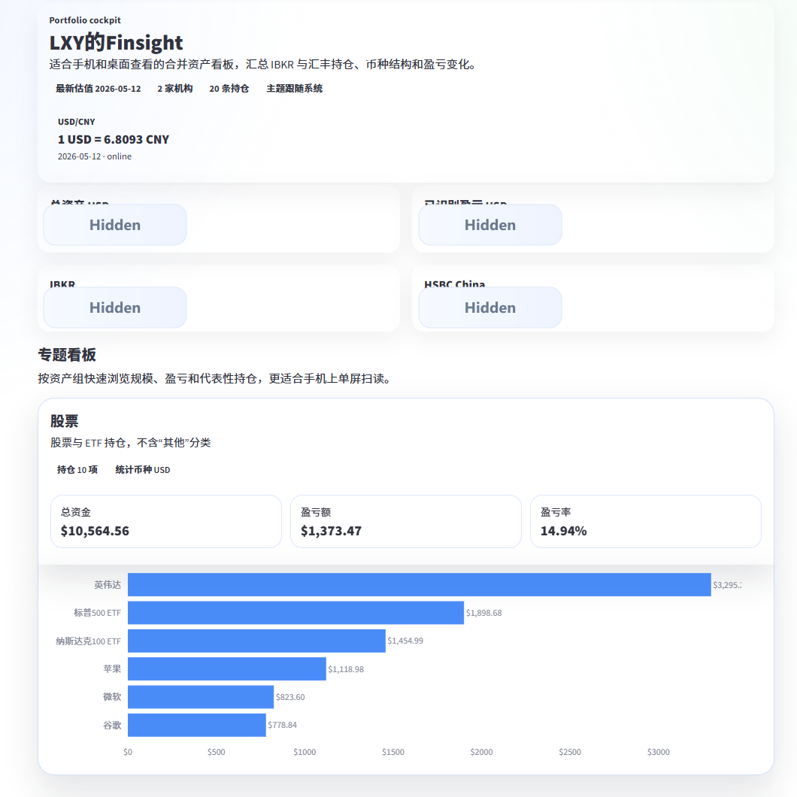
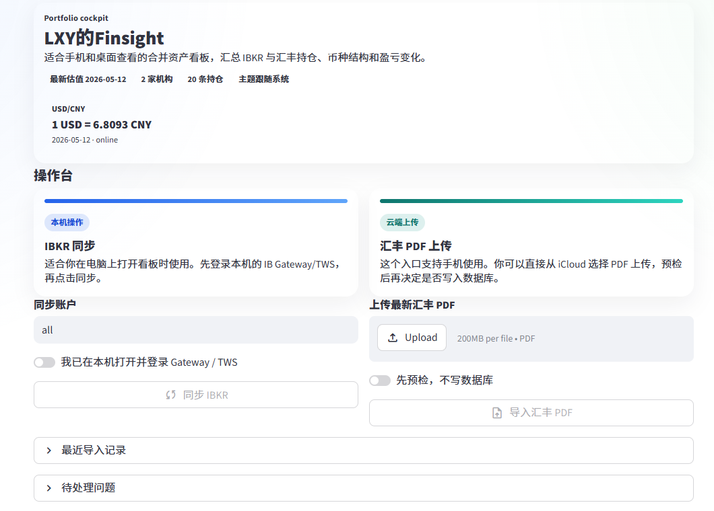
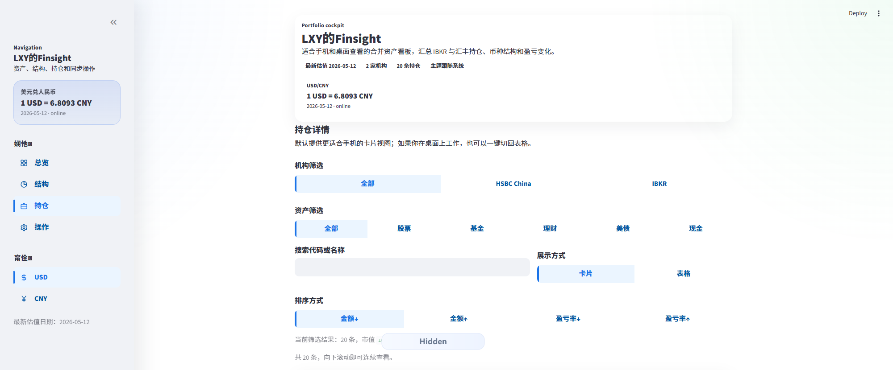

# FinSight

FinSight 是一个个人资产看板项目，用来把分散在券商、银行 PDF 和 支付宝等软件内的资产信息整理到一个统一视图里。

它的目标很直接：

- 通过 IBKR Flex 每日自动导入官方持仓和结算估值，银行通过结单 PDF 自动识别
- 云端自动同步 + 手机上传 PDF，采集和整理资产数据
- 把标准化后的结果写入 Supabase
- 用一个适合手机和桌面查看的 Streamlit 看板随时查看整体资产状态

如果你不想反复手工拼接 Excel，也不想在 IBKR、银行理财、现金和基金之间来回切页面，这个项目就是为这种场景做的。

## 项目能做什么

- 汇总多账户、多币种、多资产类型的持仓数据
- 每日自动同步 IBKR Flex 的股票、ETF 和债券持仓
- 导入汇丰中国 PDF 资产报告
- 导入标准化 CSV 交易或快照数据
- 将不同来源的数据整理成统一结构后写入 Supabase
- 在一个看板里展示资产总览、结构分布、持仓明细、导入记录和异常状态
- 首页收益日历可切换总收益、理财收益和投资收益
- 每天首次打开看板时自动刷新可识别基金/QDII净值与黄金报价，写入完整账户快照后自动重载页面
- 支持云端只读查看，也支持可选的写回操作

## 界面截图

下面的总资产相关数字已做打码处理。







## 典型使用流程

```text
IBKR / 汇丰 PDF / CSV
         |
         v
   解析与标准化
         |
         v
     Supabase
         |
         v
 Streamlit 资产看板
```

推荐工作流：

1. 由云端每日自动同步 IBKR Flex，并按需导入 PDF 或加载 CSV。
2. 将标准化后的资产数据写入 Supabase。
3. 在手机或桌面浏览器里打开 Streamlit 看板查看最新状态。

## 核心功能

### 1. 资产看板

- 总览卡片：快速查看资产规模和导入状态
- 结构视图：按资产类型、机构、币种查看分布
- 持仓明细：兼顾手机卡片视图和桌面浏览体验
- 汇率兜底：在线汇率不可用时支持手动汇率流程

### 2. 数据导入

- IBKR Flex：看板每日首次打开时自动同步官方持仓和结算估值
- `scripts/import_hsbc_pdf.py`：解析汇丰中国 PDF
- `scripts/import_csv.py`：导入标准化 CSV
- `scripts/load_fx_rates.py`：导入手动汇率

### 3. 云端部署友好

- 使用 `SUPABASE_ANON_KEY` 提供只读看板访问
- 可选使用 `SUPABASE_SERVICE_ROLE_KEY` 支持看板侧写入
- 支持部署到 Streamlit Community Cloud

## 快速开始

### 环境要求

- Python 3.10+
- 一个 Supabase 项目
- 已启用的 IBKR Flex Web Service

### 安装

```powershell
python -m venv .venv
.\.venv\Scripts\Activate.ps1
python -m pip install --upgrade pip
pip install -e .
```

### 配置环境变量

```powershell
Copy-Item .env.example .env
```

然后填写 `.env`：

```text
SUPABASE_URL=
SUPABASE_ANON_KEY=
SUPABASE_SERVICE_ROLE_KEY=
STREAMLIT_PASSWORD=
FX_API_URL=https://open.er-api.com/v6/latest/USD
IBKR_FLEX_TOKEN=
IBKR_FLEX_QUERY_ID=1587428
```

如果暂时没有配置 Supabase，应用也可以先使用本地样例数据运行。

### 初始化数据库

在 Supabase 的 SQL Editor 中执行 [sql/schema.sql](sql/schema.sql)。

### 启动看板

```powershell
streamlit run app/streamlit_app.py
```

也可以直接使用：

```powershell
start_dashboard.bat
```

## 导入示例

### 同步 IBKR

配置 Flex Token 和 Query ID 后，看板每日首次打开时自动同步，也可在行情刷新区手动重试。

### 导入汇丰中国 PDF

```powershell
python scripts/import_hsbc_pdf.py path\to\hsbc_cn_statement.pdf
```

### 导入 CSV

```powershell
python scripts/import_csv.py sample_data/transactions_template.csv
```

### 导入手动汇率

```powershell
python scripts/load_fx_rates.py sample_data/fx_rates.csv
```

## 云端部署说明

部署到 Streamlit Community Cloud 时，建议使用：

- 分支：`master`
- 入口文件：`app/streamlit_app.py`

Secrets 至少需要：

```toml
SUPABASE_URL = "https://your-project.supabase.co"
SUPABASE_ANON_KEY = "your-anon-key"
STREAMLIT_PASSWORD = "your-dashboard-password"
FX_API_URL = "https://open.er-api.com/v6/latest/USD"
```

如果你希望从云端看板直接执行写回操作，再额外配置：

```toml
SUPABASE_SERVICE_ROLE_KEY = "your-service-role-key"
```

更完整的部署说明见 [docs/streamlit_cloud_deploy.md](docs/streamlit_cloud_deploy.md)。

## 仓库结构

```text
app/                    Streamlit 应用入口
src/portfolio_mvp/      数据模型、解析器、集成层、仓储层
scripts/                同步和导入脚本
sql/                    数据库结构与报表 SQL
sample_data/            本地测试样例数据
tests/                  dashboard、parser、FX、IBKR 测试
docs/                   架构与部署说明
```

## 运行测试

```powershell
python -m pytest
```

## 当前状态

目前已经覆盖：

- IBKR 同步
- 汇丰中国 PDF 解析
- 标准化 CSV 导入
- Supabase 持仓存储
- 适合手机浏览的 Streamlit 资产看板

后续比较值得继续做的方向包括：支持实时行情API自动根据股价更新持仓、更多银行或券商 parser（可能通过截图方式导入）、更完整的收益分析，以及更自动化的定时导入流程。
